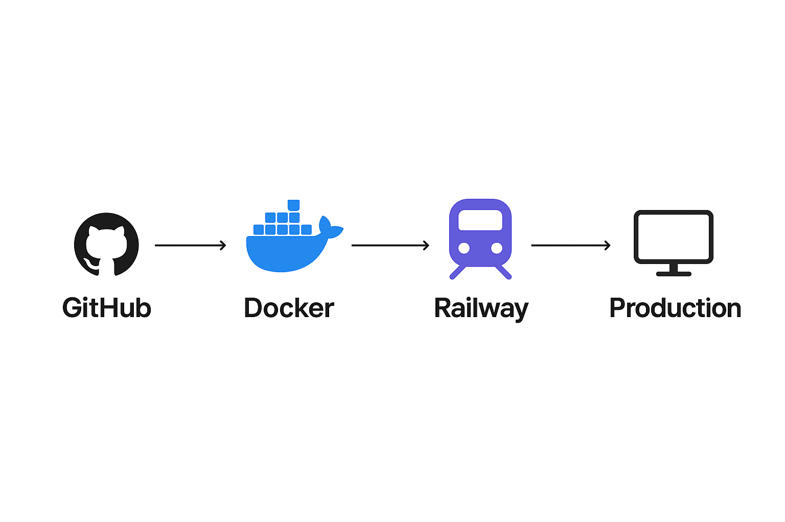

# AI Email Classifier: Extended Smart Inbox Assistant(CI/CD)

## Overview

AI Email Classifier – Extended Smart Inbox Assistant is a Dockerized, CI/CD-enabled full-stack Gmail automation system built as an educational project to gain real-world experience in DevOps, cloud deployment, and secure ML systems.

The system pulls emails in real time, classifies them (business, spam, personal, etc.), analyzes sentiment to flag urgent messages, generates AI-assisted reply drafts, and sends threaded email responses via the Gmail API. All updates are reflected instantly on a live dashboard using Socket.IO 
## Key Features

* Real-Time Classification: Gmail Pub/Sub webhooks + Hugging Face zero-shot (BART-large-MNLI) for labels/confidence.
* Sentiment & Priority: RoBERTa analysis (positive/neutral/negative) with badges (red for high-priority complaints).
* AI Auto-Replies: GPT-4o-mini drafts + Gmail API sends (threaded, rate-limit retry).
* Live Dashboard: Next.js tabs (Inbox/Sent), stats, expandable cards, SocketIO updates.
* Deduplication & Reliability: Thread dedup, OpenAI retry, SQLite/Postgres pooled (20 connections).
* Secure Auth: JWT login/register (single-user—matches Gmail owner email; no multi-access).
* Optimized Deploy: Docker multi-stage (slim ~2GB), lazy model load (OOM-proof), 1 gunicorn worker.

## Tech Stack

* Backend  
Flask 3.0, Gmail API (google-api-python-client), OpenAI API (GPT-4o-mini), Hugging Face Transformers (BART/RoBERTa v4.45), NLTK (parsing), SQLAlchemy (SQLite/Postgres), Flask-SocketIO (real-time), Flask-CORS/JWT-Extended (auth), Gunicorn (server), dotenv (secrets), Werkzeug (hashing)

* ML/Real-Time   
PyTorch (CPU), Google Pub/Sub (webhooks), SocketIO (push)

* Auth/Security  
JWT (flask-jwt-extended), Password hashing (Werkzeug)

* Deploy/Dev  
Docker (multi-stage, slim image) , Railway (CI/CD), GitHub Actions (workflow), .gitignore/.dockerignore (security)

## Production Deploy (Railway)
## CI/CD Pipeline (GitHub Actions)
* Trigger: Push/PR to main.
* Flow: Test (pytest/npm test) → Deploy backend/frontend to Railway.
* Workflow: .github/workflows/deploy.yml.
* Secrets: Actions (RAILWAY_TOKEN, PROJECT_ID, SERVICE_IDs,etc).

